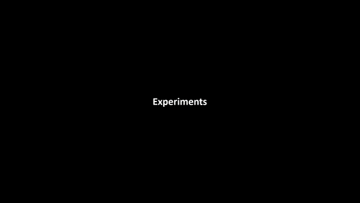

# MLMapping(Multilayer Mapping Kit)

### Introduction
**MLMapping** is a multilayer mapping framework designed for autonomous UAV navigation applications. In this framework, we divided the map into three layers: awareness, local, and global. The awareness map is constructed on the cylindrical coordinate, which enables fast raycasting. The local map is a probability-based volumetric map. The global map adopts dynamic memory management, allocating memory for the active mapping area, and recycling the memory from the inactive mapping area. The framework supports different kinds of map outputs for the global or local path planners.

### Videos:
<a href="https://www.youtube.com/embed/kBLQzIB_kWo" target="_blank"></a>

| Fast Raycasting    | Large Scale Mapping   | Autonomous UAV Navigation  |
| ---------------------- | ---------------------- |---------------------- |
|   |   |   |

### Publications
[Chen, S., Chen, H., Chang, C. W., & Wen, C. Y. (2021). Multilayer Mapping Kit for Autonomous UAV Navigation. IEEE Access.](https://ieeexplore.ieee.org/abstract/document/9336584)
### Compile
Clone this repository to catkin src folder say: ~/catkin_ws/src
````
cd ~/catkin_ws/src
git clone https://github.com/HKPolyU-UAV/MLMapping.git
````
Install 3rd Part library
````
cd catkin_ws/src/glmapping/3rdPartLib/
./install3rdPartLib.sh
````
Compile
````
cd ~/catkin_ws/
catkin_make
````

### Verify Using Provided Dataset
Download the [Large Scale Mapping Dataset](https://connectpolyu-my.sharepoint.com/:u:/g/personal/17903070r_connect_polyu_hk/EYGhc0ijYl9Muq33mUSCgxABZgNBJrTQPp34SY65gWoXRA?e=8lkjxb) into the bag folder <br />
decompress the rosbag
````
rosbag decompress corridor.bag
````
run 
````
roslaunch mlmapping rviz.launch
roslaunch mlmapping mlmapping_bag_l515_t265.launch
````

### Maintainer
[Shengyang Chen](https://www.polyu.edu.hk/researchgrp/cywen/index.php/en/people/researchstudent.html)(Dept.ME,PolyU): shengyang.chen@connect.polyu.hk <br />

